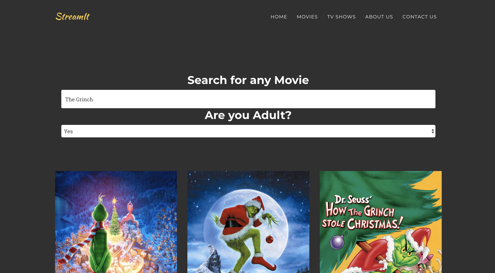

# StreamIt

StreamIt is a modern web application that allows you to search, view and stream movies and television shows found on the internet.

### Home Page

### The latest movies

### The Results of a Movie Search

##Bugs
A list of reported bugs can be found [here](https://github.com/hrishi7/streamIt/issues). If your bug has yet to be reported, feel free to open a [new issue here](https://github.com/hrishi7/streamIt/issues/new).
